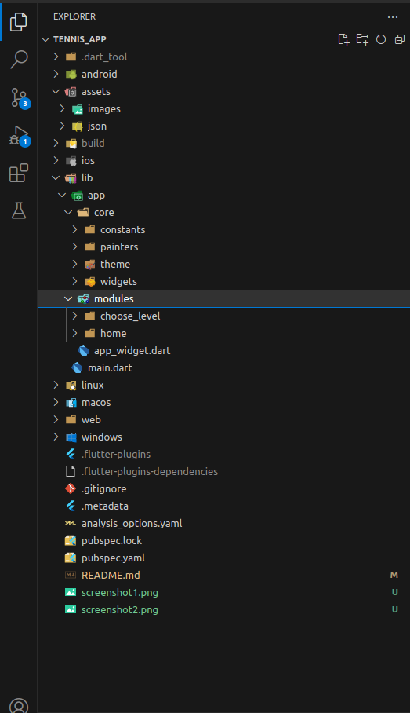

# :pencil2: Tenis App

Este aplicativo visa aprimorar meu treinamento em design de layout no framework Flutter. Com recursos específicos para Flutter, ele oferece um ambiente prático para desenvolver habilidades na criação de layouts intuitivos e atraentes. Nele, posso explorar diversas técnicas de design de interface, utilizando os componentes e recursos disponíveis no Flutter.

## :heavy_check_mark: Telas do projeto

## :computer: Tecnologias, APIs, Packages utilizados:
  
  * Flutter / Dart
  * VSCode IDE
  * Navigator(Nativo)
  * Google Fonts

## :file_folder: Organização de pastas e arquivos do projeto:

# :iphone: Testes em Plataformas Android e IOS

  - Sim.
